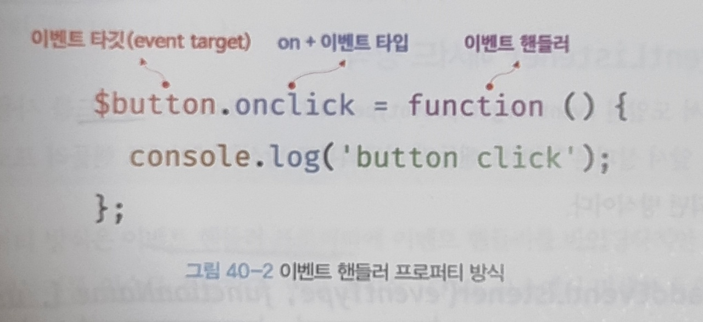
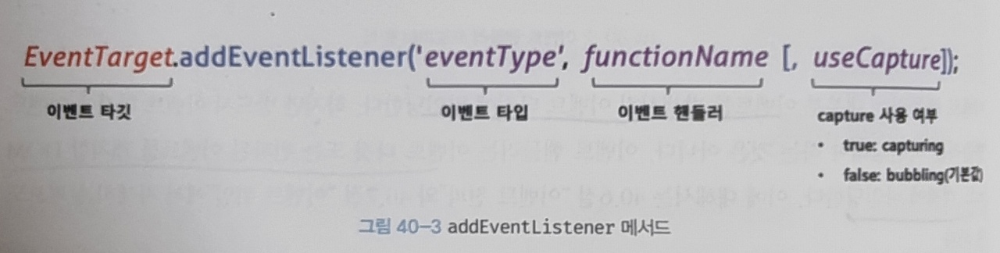

# 이벤트 핸들러 Event handler

<br/>

## 이벤트 핸들러?

이벤트가 발생했을 때 호출될 함수

함수를 언제 호출할 지 알 수 없으므로 브라우저에게 함수 호출을 위임.

<br/>

## 이벤트 핸들러 등록

브라우저에게 이벤트 핸들러의 호출을 위임하는 것

<br/>

### 어트리뷰트 방식

*on + 이벤트 종류를 나타내는 이벤트 타입 (ex. onclick)*

```jsx
<button onclick = "scrollby(event)">scroll by 100px(y)</button>

<script>
  function scrollby(event) {
    window.scrollBy(0, 100);
</script>
```

어트리뷰트 방식은 값으로 문을 할당하기 때문에 함수 자체가 아니라 함수의 평가결과가 이벤트 핸들러로 등록된다. 

즉, 문 자체가 'onclick' 이라는 함수몸체가 되는 것이다. (위에선  'scrollby(event)')

<br/>

```jsx
functtion onclick(event) {
  scrollby(event)
}
```

이벤트가 발생하면 위와 같이 onclick이라는 변수가 암묵적으로 생성되고, 그 안에 위에서 할당했던 scollby함수가 몸체를 이루게 된다.

그런데 이 onclick이라는 함수는 event라는 이름을 매개변수로 갖기 때문에 이벤트 객체를 전달받기 위해선

이벤트 핸들러(scrollby)의 첫 매개변수 이름은 무조건 event여야한다.

<br/>

```jsx
<button onclick = "scrollby(event)">scroll by 100px(y)</button>
```

HTML과 JS는 관심사가 다르니 한 곳에 담아두는 것은 별로 안 좋다. 그러니 위 방식은 사용하지 않는 것을 권장한다.

하지만 CBD방식의 Angular/React/Svelte/Vue.js 같은 프레임워크/라이브러리는

HTML,CSS,JS은 전반적으로 봤을 때 뷰 구성요소라는 하나의 틀로 보기 때문에 위와같은 어트리뷰트 방식을 사용한다.

<br/>
<br/>

### 프로퍼티 방식

```jsx
<button id = "scroll-to">scroll to 100px(y)</button>

<script>
  const scrollTo = document.querySelector("#scroll-to");
	
  scrollTo.onclick = () => {
    window.scrollTo({top: 100, behavior:"smooth"}) 
  };
</script>
```

이벤트를 발생시킬 이벤트 타겟이나 전파된 이벤트를 캐치할 DOM에 이벤트 핸들러를 직접 바인딩 시킨다.

위에선 scrollTo 어트리뷰트를 불러와 onclick이라는 이벤트 핸들러에 직접 바인딩 시켰다.

<br/>



이 방법의 단점이 있다면 이벤트 핸들러 프로퍼티에 하나의 이벤트 핸들러만 바인딩이 가능하다는 것.

<br/>
<br/>

### addEventListener 메서드 방식

```jsx
<button class = "scroll-into">scroll into speical</button>

<script>
  const scrollInto = document.querySelector(".scroll-into");

	scrollInto.addEventListener('click', (event) => {
    special.scrollIntoView(true)
  });
</script>
```

DOM Level2에 도입된 방식이다. (위 두개는 Level 0)

다른 방법과 다르게 접두사 on을 붙이지 않고, 이벤트 핸들러를 직접 바인딩 하는 것이 아닌 인수로 전달한다.

<br/>



<br/>
<br/>
<br/>

## 이벤트 핸들러 제거
<br/>

### removeEventListener 메서드 방식

```jsx
<script>
  const scrollInto = document.querySelector(".scroll-into");
  const handleClick = special.scrollIntoView(true);

	scrollInto.addEventListener('click', handleClick);

  // removeEventListener 메서드로 제거
	scrollInto.removeEventListener('click',handleClick); //성공

  // 전달한 인수가 일치하지 않으면 제거되지 않는다
  scrollInto.removeEventListener('click',handleClick, true); //실패
</script>
```

전달된 인수가 일치하지 않으면 이벤트 핸들러가 제거되지 않는다. 따라서 무명함수는 제거할 수 없다.

물론, argument.callee로 제거할 수 있지만 코드최적화를 방해하므로 가급적 변수나 자료구조에 저장하여 제거하는 것을 추천한다.

<br/>

### 프로퍼티 방식

```jsx
<script>
  const scrollTo = document.querySelector("#scroll-to");
	
  const handleClick = window.scrollTo({top: 100, behavior:"smooth"});

  scrollTo.onclick = handleClick;

  // removeEventListener 메서드로는 제거할 수 없음
	scrollTo.removeEventListener('click',handleClick);

  // 이벤트 핸들러 프로퍼티에 null을 할당하여 제거
  scrollTo.onclick = null;
</script>
```

이벤트 핸들러 프로퍼티에 null을 할당하여 제거한다.
<br/>
