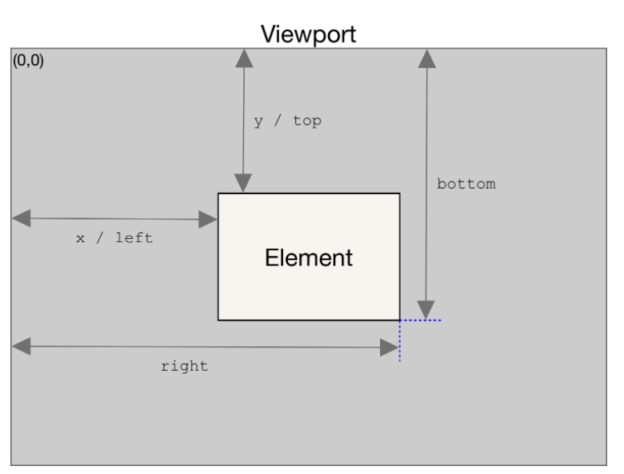

 date: Jul/11/2021 

# WebAPIs
## Review

 

This is my firsttime to write down HTML with JS code, 'cause I've practiced algorithm and data structure.

When I wrote down codes with JS, I thought 'What is it? it's.. a kind of different from what I studied?' 
That's becuase I didn't study on parts of Event, Promise, Ajax, Browser etc.. yet.

Collecting new knowledge makes me thrilled, though.

 

## What I learned

 

* webAPIs list : https://developer.mozilla.org/en-US/docs/Web/API

* Event handler : ./Note_Eventhandler.md 
* Window/Brower size

   

