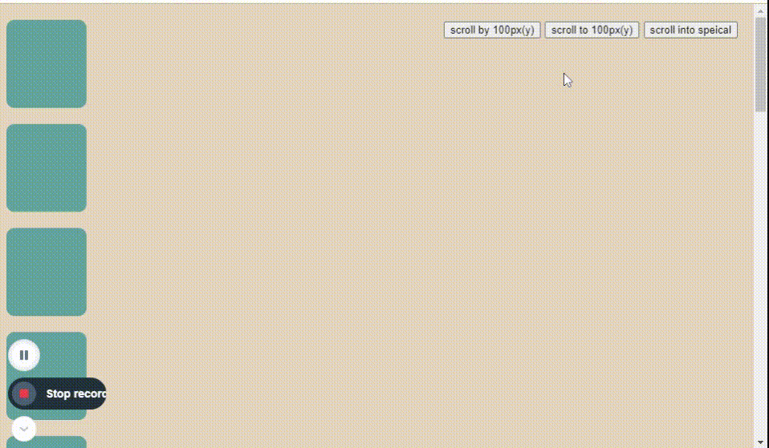

# WebAPIs_CodeReview

## 실행화면


<br/>

## 스크롤바를 내려도 상단에 버튼을 고정하는 방법
 
### ❓ Before              

```jsx
//before

.scrollinto {
  position: fixed;
  left: 410px;
  top: 10px;
  } 

  .scrollby {
  position: fixed;
  left: 280px;
  top: 10px;
  }

#scrollto {
  position: fixed;
  left: 150px;
  top: 10px;
  }

<body>
  buttons
</body>
```

👉🏽 각 클래스 및 id별로 위치를 지정해줌
<br/>
<br/>

### ‼️ After

```jsx
//after

aside{
    position: fixed;
    top: 20px;
    right: 20px;
  }

<aside>
  buttons
</aside>
```

👉🏽 button을 aside태그에 넣어 해당 태그 전체를 고정

<br/>
<br/>

## 어트리뷰트 → DOM 프로퍼티 변환 시 이름표기법

```jsx
const scrollTo = document.querySelector("#scroll-to");
const scrollInto = document.querySelector(".scroll-into");
```
<br/>

👉🏽 어트리뷰트 값일 때에는 '-'연산자를 통해 이름을 표기했지만

👉🏽 DOM 프로퍼티에 할당 될 때는 카멜케이스로 바뀐다.

😄 DOM 부분에서 읽었어서 선생님 코드 보면서 '아 이게 이건가?'라는 생각을 하게 됐다. 그래서 뭔가 그냥 혼자 뿌듯.ㅋㅋ


<br/>
<br/>

## 관련내용 정리
👉 [이벤트 핸들러란?](Note_Eventhandelr.md)
